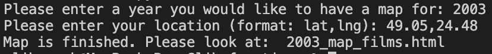

# Web_map
*Web_map* is a program for generating a map with locations of films which were
released in the given user's year near the user's place.
## Functions
Program consists of 3 different modules :
1. **data.py** - for transforming a data from locations.list into locations.csv.
2. **map_generating.py** - for finding out the distances, the nearest films and 
generating a map.
3. **main.py** - main module.
## Example of usage
First of all, open **main.py** and run it. Program will ask you to input some
characteristics.

After that you may find a HTML-file with map.

The example of a map :
